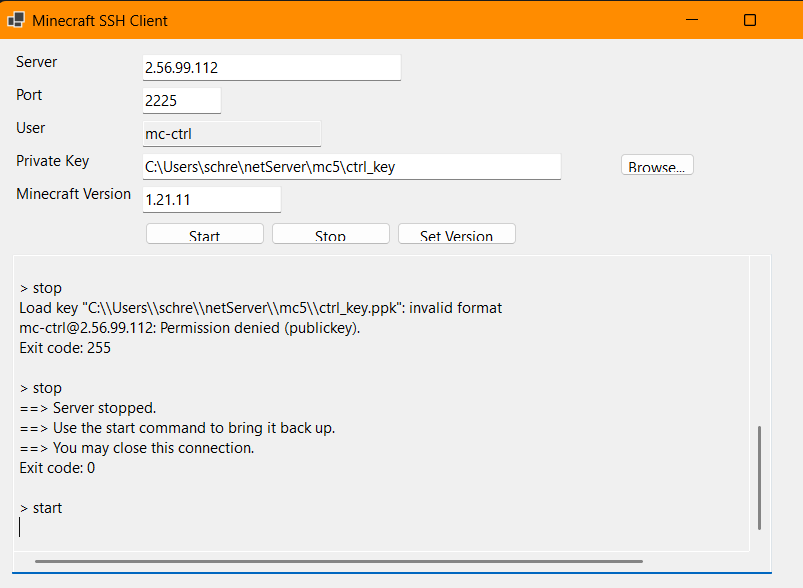

# Minecraft SSH Client for Windows

Eine kleine Windows-Desktop-App, um einen Minecraft-Server per SSH zu steuern – ohne PuTTY oder Kommandozeile.



---

## Inhaltsverzeichnis

1. [Überblick](#überblick)
2. [Voraussetzungen](#voraussetzungen)
3. [Installation & Build](#installation--build)
4. [Programmoberfläche](#programmoberfläche)
5. [Bedienungsanleitung](#bedienungsanleitung)
   - [Verbindung konfigurieren](#verbindung-konfigurieren)
   - [Server starten](#server-starten)
   - [Server stoppen](#server-stoppen)
   - [Minecraft-Version wechseln](#minecraft-version-wechseln)
6. [SSH-Key einrichten](#ssh-key-einrichten)
7. [Fehlerbehebung](#fehlerbehebung)
8. [Hinweise zur Sicherheit](#hinweise-zur-sicherheit)

---

## Überblick

Der **Minecraft SSH Client** ist eine schlanke Windows-App (.NET 8 / WinForms), die drei Steuerkommandos per SSH an einen Minecraft-Server sendet:

| Schaltfläche | Gesendeter Befehl            | Funktion                          |
|--------------|------------------------------|-----------------------------------|
| **Start**    | `start`                      | Server starten                    |
| **Stop**     | `stop`                       | Server herunterfahren             |
| **Set Version** | `version <Versionsnummer>` | Minecraft-Version wechseln        |

Der Benutzername ist fest auf `mc-ctrl` gesetzt. SSH-Port und Private-Key-Pfad sind frei konfigurierbar.

---

## Voraussetzungen

| Anforderung | Details |
|-------------|---------|
| **Betriebssystem** | Windows 10 oder Windows 11 |
| **OpenSSH Client** | Muss als Windows-Feature installiert sein (`ssh.exe` muss verfügbar sein) |
| **.NET 8 SDK** | Nur zum Selbst-Kompilieren notwendig; die fertige EXE ist self-contained |
| **SSH-Zugang** | Ein SSH-Schlüsselpaar (Public Key) muss auf dem Server für den Benutzer `mc-ctrl` hinterlegt sein |

### OpenSSH Client unter Windows installieren

1. **Einstellungen** → **Apps** → **Optionale Features** öffnen
2. **Feature hinzufügen** klicken
3. **OpenSSH Client** suchen und installieren
4. Danach steht `ssh.exe` unter `C:\Windows\System32\OpenSSH\ssh.exe` zur Verfügung

---

## Installation & Build

### Fertige EXE verwenden

Die kompilierte Anwendung aus dem [neuesten Release](https://github.com/cndrbrbr/StudendcontrolsServer/releases) herunterladen und direkt starten – keine Installation notwendig.

### Selbst kompilieren

1. Repository klonen:
   ```bash
   git clone https://github.com/cndrbrbr/StudendcontrolsServer.git
   cd StudendcontrolsServer
   ```

2. In PowerShell im Projektordner kompilieren:
   ```powershell
   dotnet publish .\MinecraftSshClient\MinecraftSshClient.csproj -c Release -r win-x64 --self-contained true
   ```

3. Die fertige EXE liegt danach hier:
   ```
   MinecraftSshClient\bin\Release\net8.0-windows\win-x64\publish\MinecraftSshClient.exe
   ```

---

## Programmoberfläche

```
┌─────────────────────────────────────────────────────┐
│  Server      [ 2.56.99.112                        ] │
│  Port        [ 22     ]                             │
│  User        [ mc-ctrl  ]  (nicht änderbar)         │
│  Private Key [ C:\Users\..\.ssh\id_ed25519   ] [..] │
│  MC Version  [ 1.20.4  ]                            │
│                                                     │
│  [ Start ]  [ Stop ]  [ Set Version ]               │
│                                                     │
│  ┌─────────────────────────────────────────────┐    │
│  │ Ausgabe-Log                                 │    │
│  │ > start                                     │    │
│  │ Exit code: 0                                │    │
│  └─────────────────────────────────────────────┘    │
└─────────────────────────────────────────────────────┘
```

---

## Bedienungsanleitung

### Verbindung konfigurieren

Beim ersten Start die Verbindungsdaten einmalig eintragen:

| Feld | Beschreibung | Beispiel |
|------|--------------|---------|
| **Server** | Hostname oder IP-Adresse des Minecraft-Servers | `2.56.99.112` oder `mc.example.com` |
| **Port** | SSH-Port des Servers (Standard: 22) | `22` oder `2222` |
| **User** | Fest auf `mc-ctrl` gesetzt, nicht änderbar | `mc-ctrl` |
| **Private Key** | Vollständiger Pfad zur privaten SSH-Schlüsseldatei | `C:\Users\MaxMustermann\.ssh\id_ed25519` |

Der **Browse...**-Button öffnet einen Datei-Dialog, um den Private Key bequem auszuwählen.

> **Hinweis:** Die Eingaben werden nicht gespeichert. Nach einem Neustart der App müssen die Felder erneut ausgefüllt werden.

---

### Server starten

1. Verbindungsdaten wie oben beschrieben ausfüllen
2. Auf **Start** klicken
3. Die App sendet den Befehl `start` per SSH an den Server
4. Ergebnis und Exit-Code erscheinen im Ausgabe-Log

**Erwartete Ausgabe bei Erfolg:**
```
> start
Exit code: 0
```

---

### Server stoppen

1. Verbindungsdaten ausfüllen
2. Auf **Stop** klicken
3. Die App sendet den Befehl `stop` per SSH an den Server
4. Der Server fährt geordnet herunter

**Erwartete Ausgabe bei Erfolg:**
```
> stop
Exit code: 0
```

---

### Minecraft-Version wechseln

1. Verbindungsdaten ausfüllen
2. Im Feld **MC Version** die gewünschte Versionsnummer eingeben, z. B. `1.20.6` oder `1.21.1`
3. Auf **Set Version** klicken
4. Die App sendet `version 1.20.6` (oder die eingegebene Version) per SSH

**Erwartete Ausgabe bei Erfolg:**
```
> version 1.20.6
Exit code: 0
```

> **Achtung:** Der Server muss vorher gestoppt werden, damit der Versionswechsel wirksam wird.

---

## SSH-Key einrichten

Damit die App sich am Server anmelden kann, muss ein SSH-Schlüsselpaar vorhanden sein.

### Schlüsselpaar erzeugen (einmalig)

PowerShell öffnen und folgenden Befehl ausführen:

```powershell
ssh-keygen -t ed25519 -C "minecraft-client"
```

- Speicherort bestätigen (Standard: `C:\Users\<Name>\.ssh\id_ed25519`)
- Passphrase optional (leer lassen für passwortlosen Zugriff)

Es entstehen zwei Dateien:
- `id_ed25519` – **Private Key** (geheim halten, wird in der App eingetragen)
- `id_ed25519.pub` – **Public Key** (wird auf dem Server hinterlegt)

### Public Key auf dem Server hinterlegen

Den Inhalt von `id_ed25519.pub` auf dem Server in die Datei `/home/mc-ctrl/.ssh/authorized_keys` eintragen:

```bash
echo "ssh-ed25519 AAAA... minecraft-client" >> /home/mc-ctrl/.ssh/authorized_keys
chmod 600 /home/mc-ctrl/.ssh/authorized_keys
```

---

## Fehlerbehebung

| Problem | Mögliche Ursache | Lösung |
|---------|-----------------|--------|
| `ssh.exe not found` | OpenSSH Client nicht installiert | OpenSSH Client als Windows-Feature nachinstallieren (siehe [Voraussetzungen](#voraussetzungen)) |
| `Private key file not found` | Pfad im Feld **Private Key** ist falsch | Pfad prüfen oder **Browse...** nutzen |
| `Permission denied (publickey)` | Public Key nicht auf dem Server hinterlegt | Prüfen ob `id_ed25519.pub` in `authorized_keys` steht |
| `Connection refused` | Falscher Port oder Server nicht erreichbar | Port und Hostname/IP prüfen; Firewall kontrollieren |
| `Invalid SSH port` | Port-Eingabe enthält keine gültige Zahl | Nur Zahlen zwischen 1 und 65535 eingeben |
| Exit code ≠ 0 | Befehl auf dem Server fehlgeschlagen | Log-Ausgabe lesen; Server-Logs auf dem Host prüfen |

---

## Hinweise zur Sicherheit

- **Private Keys niemals unverschlüsselt weitergeben.** Die Datei `id_ed25519` enthält den geheimen Schlüssel und darf nur dem eigenen Benutzer zugänglich sein.
- Der Host-Key des Servers wird beim **ersten Verbindungsaufbau** automatisch akzeptiert (`StrictHostKeyChecking=accept-new`) und in der `known_hosts`-Datei gespeichert. Nachfolgende Verbindungen werden gegen diesen gespeicherten Key geprüft.
- Auf dem Server sollte der `mc-ctrl`-Key per `command=`-Einschränkung in der `authorized_keys` auf die erlaubten Befehle begrenzt werden, um Missbrauch zu verhindern:
  ```
  command="/opt/mc-ctrl/wrapper.sh",no-pty,no-port-forwarding ssh-ed25519 AAAA...
  ```

---

## Lizenz

Apache License 2.0 – siehe [LICENSE](LICENSE)
